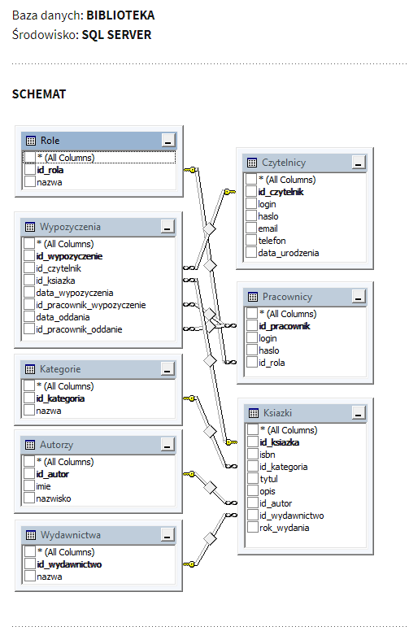

# Library Management program
> Program to rent and retrieve books

## Table of contents
* [General info](#general-info)
* [Screenshots](#screenshots)
* [Technologies](#technologies)
* [Setup](#setup)
* [Features](#features)
* [Status](#status)
* [Inspiration](#inspiration)
* [Contact](#contact)

## General info
Program is created to practice full flow of data.

## Screenshots
Database schema 

## Technologies
* SpringBoot
* Gradle
* MySQL Community Server 8.0.23
* Apache Tomcat 9
* JUnit 4
* JodaTime 2.10.5
* slf4j 1.7.30
* log4j 1.2.17

## Setup
None

## Code Examples
Show examples of usage:
`put-your-code-here`

## Features
List of features ready and TODOs for future development
* Awesome feature 1
* Awesome feature 2
* Awesome feature 3

To-do list:
* Web interface
* end-to-end tests
* Test groups @Tag
* Read CSV/JSON file of books and users
* LogIn and user verification

## Status
Project is: _in progress_.

## Inspiration
Project inspired by self development

## Contact
Created by [@AdamSobieraj](https://github.com/AdamSobieraj) - feel free to contact me!